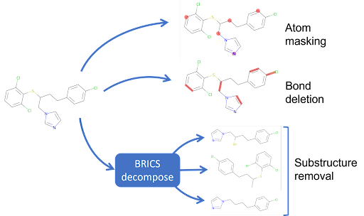
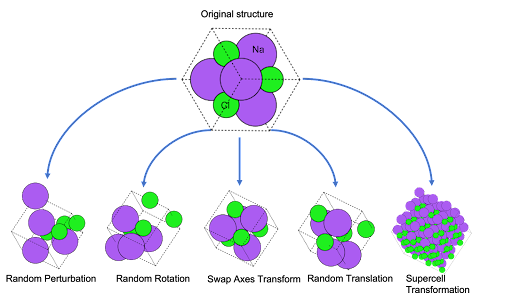

<!--  -->

Welcome to AugLiChem!
The augmentation library for chemical structures.
This package supports augmentation for both crystaline and molecular systems, as well as provides automatic downloading for our benchmark datasets, and easy to use model implementations.

AugLiChem supports three augmentations for molecular compounds: random atom masking, random bond deletion, and substructure removal.




For crystalline systems, five augmentations are supported: random perturbation, random rotation, swap axes, random translation, and supercell transformations.




## Authors

Yuyang Wang\*, Rishikesh Magar\*, Cooper Lorsung\*, Hariharan Ramasubramanian\*, Chen Liang\*, Peiyuan Li\*, Amir Barati Farimani\*

^1Department of Mechanical Engineering, Carnegie Mellon University, Pittsburgh, PA 15213

## Paper

Our paper can be found [here](https://arxiv.org/abs/2111.15112)

## Citation

If you use AugLiChem in your work, please cite:

```
@misc{magar2021auglichem,
      title={AugLiChem: Data Augmentation Library ofChemical Structures for Machine Learning}, 
      author={Rishikesh Magar and Yuyang Wang and Cooper Lorsung and Chen Liang and Hariharan Ramasubramanian and Peiyuan Li and Amir Barati Farimani},
      year={2021},
      eprint={2111.15112},
      archivePrefix={arXiv},
      primaryClass={cs.LG}
}
```

## License
AugLiChem is MIT licensed, as found in the [LICENSE](https://github.com/BaratiLab/AugLiChem/blob/main/LICENSE) file. Please note that some of the dependencies AugLiChem uses may be licensed under different terms.

