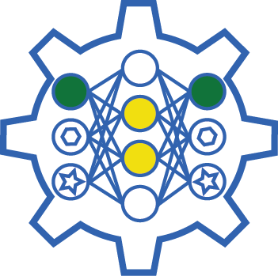

<!--  -->

Welcome to AugLiChem!
The augmentation library for chemical structures.
This package supports augmentation for both crystaline and molecular systems, as well as provides automatic downloading for our benchmark datasets, and easy to use model implementations.

AugLiChem supports three augmentations for molecular compounds: random atom masking, random bond deletion, and substructure removal.


For crystalline systems, five augmentations are supported: random perturbation, random rotation, swap axes, random translation, and supercell transformations.


## Authors

Yuyang Wang\*, Rishikesh Magar\*, Cooper Lorsung\*, Hariharan Ramasubramanian\*, Chen Liang\*, Peiyuan Li\*, Amir Barati Farimani\*

^1Department of Mechanical Engineering, Carnegie Mellon University, Pittsburgh, PA 15213

## Paper

Our paper can be found [here](https://arxiv.org/abs/2111.15112)

## Citation

If you use AugLiChem in your work, please cite:

```
@article{Magar_2022,
doi = {10.1088/2632-2153/ac9c84},
url = {https://dx.doi.org/10.1088/2632-2153/ac9c84},
year = {2022},
month = {nov},
publisher = {IOP Publishing},
volume = {3},
number = {4},
pages = {045015},
author = {Rishikesh Magar and Yuyang Wang and Cooper Lorsung and Chen Liang and Hariharan Ramasubramanian and Peiyuan Li and Amir Barati Farimani},
title = {AugLiChem: data augmentation library of chemical structures for machine learning},
journal = {Machine Learning: Science and Technology},
abstract = {Machine learning (ML) has demonstrated the promise for accurate and efficient property prediction of molecules and crystalline materials. To develop highly accurate ML models for chemical structure property prediction, datasets with sufficient samples are req    uired. However, obtaining clean and sufficient data of chemical properties can be expensive and time-consuming, which greatly limits the performance of ML models. Inspired by the success of data augmentations in computer vision and natural language processing, we develop    ed AugLiChem: the data augmentation library for chemical structures. Augmentation methods for both crystalline systems and molecules are introduced, which can be utilized for fingerprint-based ML models and graph neural networks (GNNs). We show that using our augmentatio    n strategies significantly improves the performance of ML models, especially when using GNNs. In addition, the augmentations that we developed can be used as a direct plug-in module during training and have demonstrated the effectiveness when implemented with different G    NN models through the AugliChem library. The Python-based package for our implementation of Auglichem: Data augmentation library for chemical structures, is publicly available at: https://github.com/BaratiLab/AugLiChem.},highly accurate ML models for chemical str$
}
```


## License
AugLiChem is MIT licensed, as found in the [LICENSE](https://github.com/BaratiLab/AugLiChem/blob/main/LICENSE) file. Please note that some of the dependencies AugLiChem uses may be licensed under different terms.

