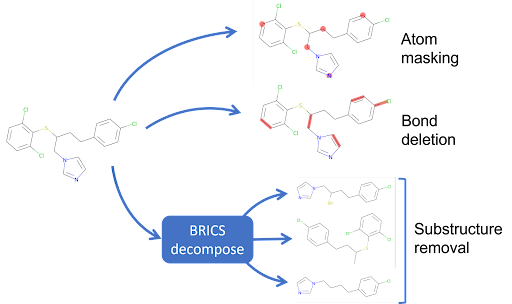
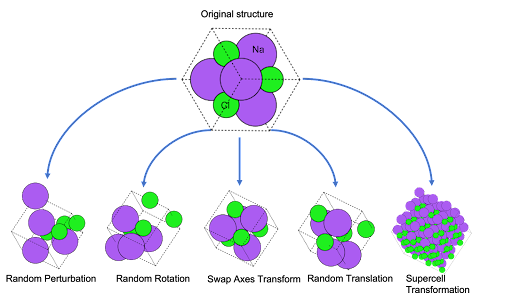

Welcome to AugLiChem!
The augmentation library for chemical systems.
This package supports augmentation for both crystaline and molecular systems, as well as provides automatic downloading for our benchmark datasets, and easy to use model implementations.

AugLiChem supports three augmentations for molecular compounds: random atom masking, random bond deletion, and substructure removal.

For crystalline systems, five augmentations are supported: random perturbation, random rotation, swap axes, random translation, and supercell transformations.

## Authors

## Paper

Our paper can be found at [PAPER URL]

## Citation

(Once on ArXiv add BibTex citation)

## License

