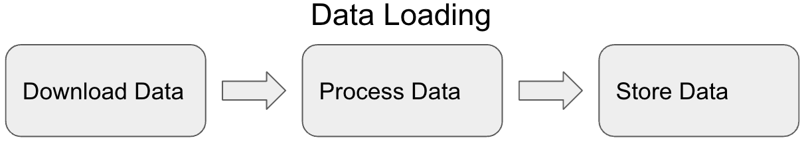
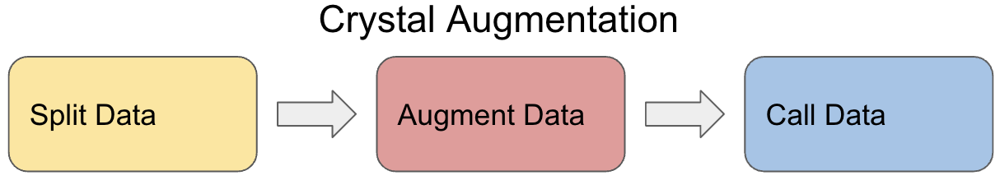
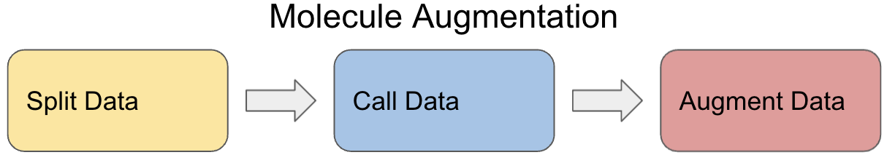

AugLiChem provides models, data sets, and augmentation functions in order to make machine learning for molecular and crystalline systems simple and easy.
Models and data wrappers are built with PyTorch and take advantage of CPU and GPU support for faster execution.

## Data Pipeline

A lot goes on under the hood in AugLiChem
Augmented data is only used in the training set.

### Data Loading



The first step in the data pipeline is to download the data set.
The molecule data sets come from [MoleculeNet](https://arxiv.org/pdf/1703.00564.pdf) and are hosted through [DeepChem](https://deepchem.io/).
The crystal data sets come primarily from [MaterialsProject](https://materialsproject.org/), and we host them through [google drive](https://drive.google.com/drive/u/1/folders/1JT6bCcCdvszQNrnSzW2wXrjaf1ATWEw4).
The built in automatic downloading takes advantage of the public nature of this data and will download, unzip, and process for you.

Many of the molecule data sets have multiple targets, and not every target has data for every molecule.
This mismatch of data can be quite challenging to handle, especially with multitarget learning.
AugLiChem handles this by removing molecules from the dataset automatically when a target or targets are specified.

Storing the data is then done with attributes that correspond to the SMILES strings and labels for molecule data sets, and the CIF file number and labels for crystal data sets.


Augmentation is handled differently for molecule and crystal data.
Molecule data comes in the SMILES string format.
Due to the standardization of this format, augmented molecules cannot be stored easily, and we do augmentation at call time when iterating over the data.
Crystal data is stored in CIF files, and the augmentations are first done, stored in CIF files next to the originals, and then loaded when called.

### Crystal Augmentation



The first step is data splitting.
Random splitting is supported for molecule data and is used to split the data into train, validation, and test sets with size specified before splitting.
For k-fold cross validation, all data is augmented during splitting, but only augmented data is added to the training set.

Once the data has been augmented for the training set, the `__getitem__` function is called to load the CIF file and return the graph representation.


### Molecule Augmentation



The first step is data splitting.
Scaffold splitting is supported for molecule data and is used to split the data into train, validation, and test sets with size specified before splitting.

The `__getitem__` method is called to load data during the training loop.
Data augmentation happens in this function, where the training data always retains an original copy of the molecule.


## Package Structure

AugLiChem has two submodules: crystal and molecule.
The directory structure has been designed so using either submodule is as easy as switching `crystal` to `molecule` in your code, when possible.

The directory structure is as follows:

```
AugLiChem/
  -auglichem/
    -crystal/
      -__init__.py  -_transforms.py
      data/
        -__init__.py  -_load_sets.py  -_crystal_dataset.py
      -models/
        -__init__.py  -cgcnn.py  -gin.py  -schnet.py
    -molecule/
      -__init__.py  -_compositions.py  -_transforms.py
      -data/
        -__init__.py  -_load_sets.py  -_molecule_dataset.py
      -models/
        -__init__.py  -afp.py  -deepgcn.py  -gcn.py  -gine.py
    -test/
      -test_crystal.py  -test_molecule.py  -test_utils.py
    -utils/
      -__init__.py  -_constants.py  -_splitting.py
  -.travis.yml
  -LICENSE
  -README.md
  -setup.py
```

