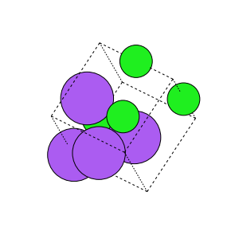

Crystals are loaded from CIF files, and the augmentations given can be stored as CIF files.
We take advantage of this fact and save augmented files next to original files.
This has the added benefit of allowing easy inspection of augmentations in their native format.

## Crystal Representation on Graphs

Bonding in crystalline systems is not as concretely defined as for molecules.
In order to construct a graph, atoms are considered bonded to their N nearest neighbors.


In this example, we have a NaCl crystal with Cl atoms labeled 0,1,2, and 3, and Na atoms labeled 4,5,6, and 7, which is behind atom 0.
We will consider each atom to be bonded to its three closest neighbors.
The atom feature captures the atom type, where atom index as labeled above is the index of our vector.
The second column is 1 if the atom is a chiral center, 0 if not.

```python
atom_feature = [[16,0],
                [16,0],
                [16,0],
                [16,0],
                [10,0],
                [10,0],
                [10,0],
                [10,0]]
```

Our edge index captures the bonds between atoms, and goes both ways.
We see even for relatively small systems, working with graph representations manually can become quite cumbersome.

```python
edge_index = [[0, 0, 0, 1, 1, 1, 2, 2, 2, 3, 3, 3, 4, 4, 4, 5, 5, 5, 6, 6, 6, 7, 7, 7],
              [4, 5, 6, 4, 6, 7, 4, 5, 7, 5, 6, 7, 0, 1, 2, 0, 2, 3, 0, 1, 3, 1, 2, 3]]
```

Lastly, the edge attribute consists of single bonds, zero-indexed like for molecular representations.
The second column is 1 if the bond is aromatic.

```python
edge_attribute = [[0, 0],
                  [0, 0],
                  [0, 0],
                  [0, 0],
                  [0, 0],
                  [0, 0],
                  [0, 0],
                  [0, 0],
                  [0, 0],
                  [0, 0],
                  [0, 0],
                  [0, 0],
                  [0, 0],
                  [0, 0],
                  [0, 0],
                  [0, 0],
                  [0, 0],
                  [0, 0],
                  [0, 0],
                  [0, 0],
                  [0, 0],
                  [0, 0],
                  [0, 0],
                  [0, 0]]

```

With our graph representation, we can use Graph Neural Networks, and can easily augment our data.


## Data Augmentation


Five augmentations are supported for crystals.
We take the original structure seen above

### Perturbation


In the random perturbation augmentation all the sites in the crystalline systemare randomly perturbed by a distance between0 to 1 A. This augmentationis especially useful in breaking the symmetries that exist between the sites inthe crystals.
This transformation can be imported and initilized as follows, where `distance` constrols how far each site is perturbed in a random direction, and `min_distance` controls the minimum distance each site is perturbed:

```python
from auglichem.crystal import PerturbStructureTransformation
transform = PerturbStructureTransformation(distance=0.01, min_distance=0.005)
```

### Rotation



In the random rotation transform, we randomly rotate the sites in the crystalbetween-90 to 90degrees. To generate a strong augmentation we initiallyuse  the  random  perturbation  augmentation  to  generate  the  initial  strcuturewhich is then rotated randomly.
This transformation can be imported and initilized as follows, where `axis` selects the axis to rotate about, and `angle` is the rotation in degrees:

```python
from auglichem.crystal import RotationTransformation
transform = RotationTransformation(axis=[1,0,0], angle=90)
```

### Swap Axes


In the swap axes transformation of the crystal, we swap the coordinates of thesites in the crystal between two axes. For example, we may swap the x and they axes coordinates or the y and z axes coordinates. The swap axes transformgreatly displaces the locations of all the sites in the crystal.
This transformation can be imported and initilized as follows, where the axes are randomly selected, and so no parameters are needed for initialization:

```python
from auglichem.crystal import SwapAxesTransformation
transform = SwapAxesTransformation()
```

### Translation


The random translate transform randomly displaces a site in the crystal bya distance between0 to 1 A. In this work, we randomly select 25% of thesites in the crystal and displace them. This creates an augmentation different from the random perturb augmentation as not all the sites in the crystal aredisplaced.
This transformation can be imported and initilized as follows, where `indices_to_move` selects which atoms to move, `translation_vector` provides a 1x3 vector for each selected atom to be translated, and `vector_in_frac_coords` controls whether or not the translation vector is interpreted as fractional coordinates of the unit cell:

```python
from auglichem.crystal import TranslateSitesTransformation
transform = TranslateSitesTransformation(
                      indices_to_move=[0,1],
                      translation_vector=[[1,0,0],[0,0,1]],
      		      vector_in_frac_coords=True
            )
```

### Supercell


The supercell transformation produces a supercell of the crystalline system.The distinct feature of the supercell of the crystal is that after transformationthe supercell represents the same crystal with a larger volume. There exists alinear mapping between the basis vectors of crystal and the basis vectors ofthe supercell.
This transformation can be imported and initilized as follows, where `scaling_matrix` is a 3x3 matrix that repeats the unit cell to create the supercell:

```python
from auglichem.crystal import SupercellTransformation
transform = SupercellTransformation(scaling_matrix=[[1,2,0],[0,3,1],[4,1,1]])
```


For a more detailed guide on using these augmentations, please read the [usage guide](../usage_guide).

In addition to the guide provided here, ready to use notebooks demonstrate both [standard training](https://github.com/BaratiLab/AugLiChem/blob/main/examples/crystal_dataset.ipynb) and [automatic k-fold cross validation](https://github.com/BaratiLab/AugLiChem/blob/main/examples/crystal_kfold_dataset.ipynb) training for both all data sets, as well as examples of training CGCNN for both [standard training](https://github.com/BaratiLab/AugLiChem/blob/main/examples/crystal_cgcnn_dataset.ipynb) and [k-fold cross validation](https://github.com/BaratiLab/AugLiChem/blob/main/examples/crystal_cgcnn_kfold_dataset.ipynb).


## Data sets

The crystalline data sets cover multiple different types of materials, as well as predicting different properties.
The data sets currently supported are: Lanthanides, Perovskites, Formation Energy, Band Gap, and Fermi Energy prediction.


## Models

In addition to data sets, AugLiChem has popular models implemented and ready to use with our graph data.
[CGCNN](https://arxiv.org/abs/1710.10324), [GIN](https://arxiv.org/pdf/1810.00826.pdf), and [SchNet](https://arxiv.org/abs/1706.08566) are all supported, and readers are referred to the respective papers for the model details.
