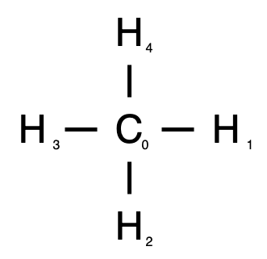
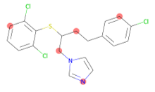
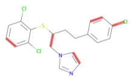
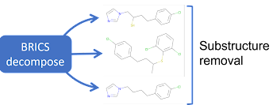

Molecular augmentation is done at call-time because augmented molecules cannot be stored in the SMILES format.
Graphs are built from the molecule, and augmentations are done on the graphical representation.

## Graphical Representation of Molecules

Molecules can be very naturally interpreted as graphs.
A finite number of possible atoms are connected by one of a finite set of bond types, and due to their inherent translational and rotational invariance, cartesian coordinates would be difficult to use.
We therefore represent atoms as nodes, with the atom type as the node attribute, and bonds are their connections with bond type being captured by the edge attribute.

In methane, we have a carbon atom surrounded by four hydrogen atoms, seen here.




The central carbon, labeled atom 0, is connected to each hydrogen, numbered 1 through 4.
Our node attirbute vector, is seen below. Atom number is captured by zero-indexed index in our vector, where the second column is 1 if the atom is a chiral center.

```python
atom_feature = [[5,0],
                [0,0],
                [0,0],
                [0,0],
                [0,0]]
```

Our edge index captures the bonds between molecules, and goes both ways.

```python
edge_index = [[0, 1, 0, 2, 0, 3, 0, 4],
              [1, 0, 2, 0, 3, 0, 4, 0]]
```

The last piece of information we have is the edge attribute.
This captures the bond type information, where 0 represents a single bond, and the second columns is 1 if the bond is aromatic.

```python
edge_attribute = [0, 0],
                 [0, 0],
                 [0, 0],
                 [0, 0],
                 [0, 0],
                 [0, 0],
                 [0, 0],
                 [0, 0]]
```

With our graph representation, we can use Graph Neural Networks, and can easily augment our data.


## Data Augmentation

### Atom Masking



Random atom masking replaces randomly selected node attributes with a mask token.
The fraction of atoms masked is passed in as an argument, and at least one atom is masked regardless of the fraction selected.
In the graph representation, the atoms are still there, but masked atoms are all represented by the same token.
This transformation can be imported and initilized as follows:

```python
from auglichem.molecule import RandomAtomMask
transform = RandomAtomMask(p=0.25)
```

### Bond Deletion



Random  bond deletion removes bonds from our graph representation.


from auglichem.molecule import RandomBondDelete
transform = RandomBondDelete(p=0.25)



### Motif Removal



Motif removal is different from the other augmentations in that it is deterministic.
A similarity score is calculated between motifs and the molecule, where motifs above the threshold are retained.
This threshold can be set by passing in an argument.

Note: MotifRemoval retains a copy of each motif while training. That is, the original data, and each motif is used in training, along with the data and motifs augmented by any additional transformations.

```python
from auglichem.molecule import MotifRemoval
transform = MotifRemoval(0.6)
```

For a more detailed guide on using these augmentations, please read the [usage guide](../usage_guide).
In addition to the guide provided here, ready to use notebooks demonstrate both [single](https://github.com/BaratiLab/AugLiChem/blob/main/examples/molecule_dataset.ipynb) and [multitarget](https://github.com/BaratiLab/AugLiChem/blob/main/examples/molecule_multitarget_dataset.ipynb) training for both regression and classification.

## Data Sets

Automatic downloading and cleaning is supported for a number of standard benchmark sets, available from moleculenet.
These benchmarks represent four different biological and physical settings: biophysics, physical chemistry, physiology, and quantum mechanics.
AugLiChem provides support for data sets in each setting:
- Biophysics:
  - MUV, HIV, PCBA, BACE
- Physical Chemistry:
  - ESOL, FreeSolv, Lipophilicity
- Physiology:
  - BBBP, Tox21, ToxCast, SIDER, ClinTox
- Quantum Mechanics:
  - QM7, QM8, QM9

## Models

In addition to data sets, AugLiChem has popular models implemented and ready to use with our graph data.
[AttentiveFP](https://pubs.acs.org/doi/10.1021/acs.jmedchem.9b00959), [Graph Convolutional Netowrk](https://arxiv.org/abs/1609.02907), [Deep Graph Convolutional Network](https://arxiv.org/abs/1904.03751), and [Modified Graph Isomorphism Network](https://arxiv.org/abs/1905.12265) are all supported, and readers are referred to the respective papers for the model details.
